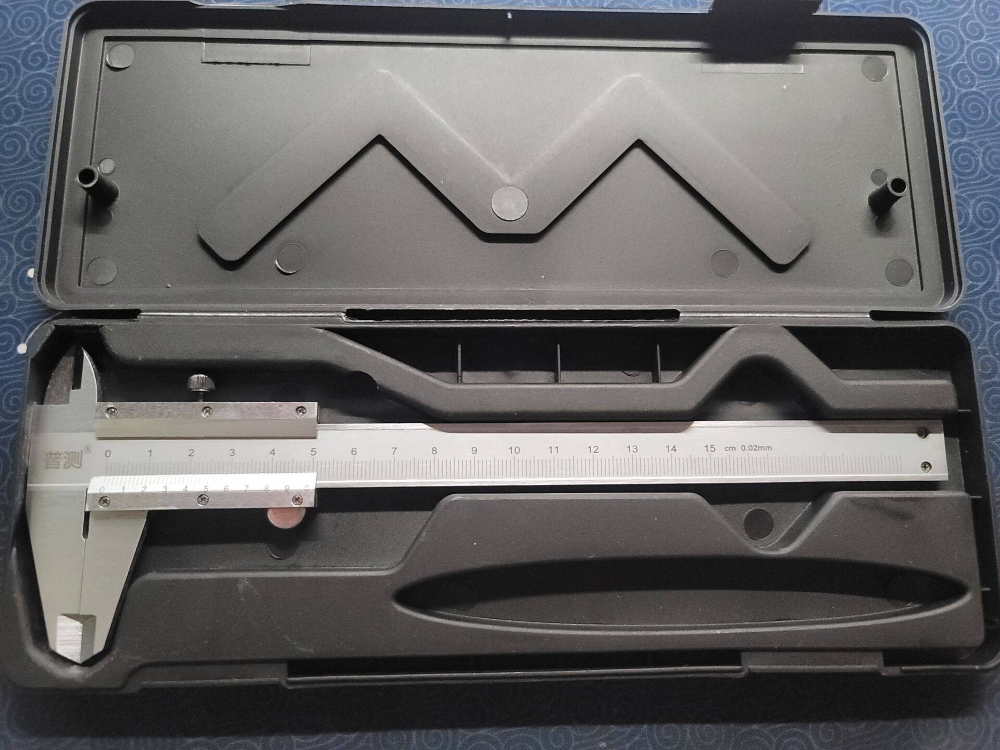

# 中车圆规测绘报告书

## 作品简介

### 测绘对象

本作品测绘对象为 STAEDTLER 施德楼 551 02 中车圆规。大多数人使用的普通圆规，采用两个齿轮张开闭合，精密度不高，而且荆轮易磨损。STAEDTLER 施德楼 551 中车圆规是具有中心轮调节功能（由头部弹性金属环、中心轴、中心轮组成）的精准几何圆规，采用全钢结构，枢纽铰链式铅芯头及定位针头。

### 测绘工具

本作品的主要测绘工具为游标卡尺。

## 主要零件组合

### 铅芯头套件

### 分规头套件

### 延长杆套件

### 中车套件

## 操作装配图

STAEDTLER 施德楼 551 02 中车圆规主要有两种使用形式，包括标准装配，可画直径 1 mm - 220 mm 的圆和使用延长杆的延长装配，最大可以绘制直径 500 mm 的圆。

### 标准装配

### 延长装配

## 爆炸和渲染图

### 爆炸图

### 渲染图

